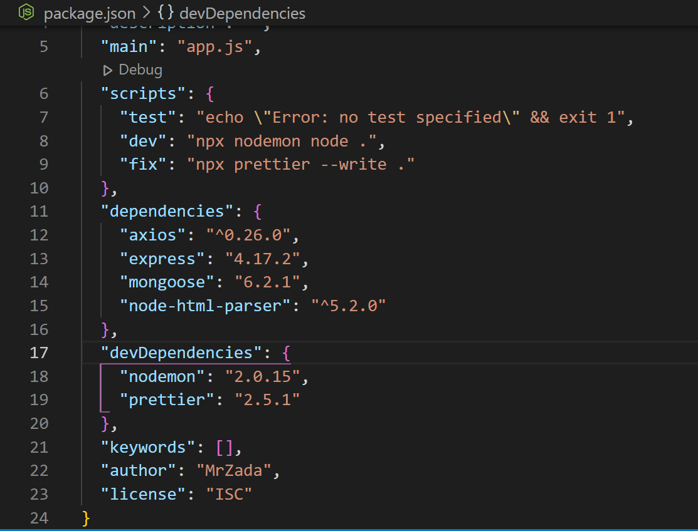
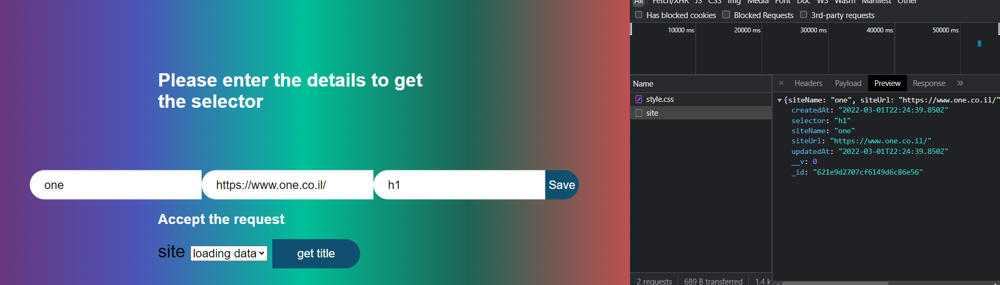
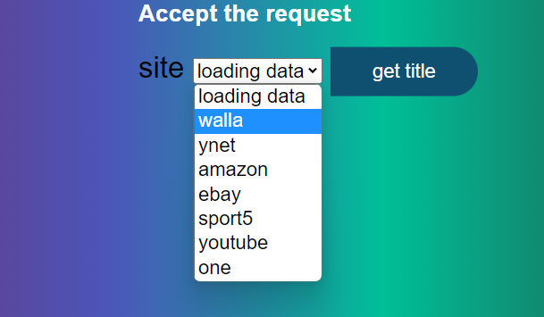
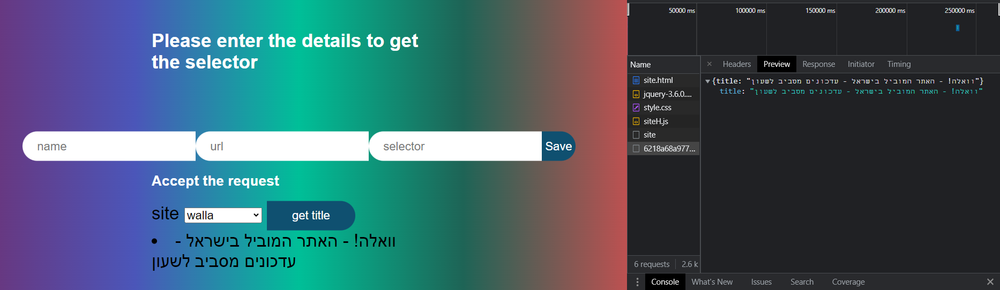

# Scrapping App
- Scrapping app that takes headlines from other sites ,
Axios is a promise based HTTP client for the browser and Node.js. Axios makes it easy to send asynchronous HTTP requests to REST endpoints and perform CRUD operations. It can be used in plain JavaScript or with a library such as Vue or React.
In this tutorial we work with Axios in a Node.js application.

# package Json
 

# Screenshots

